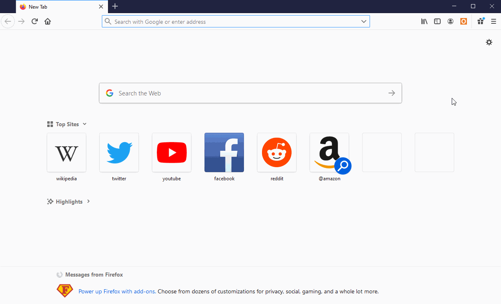

# Bargain Notifier

A WebExtension that notifies you when there are deals you are interested in on OzBargain

## Usage

(notification sped up for demonstration purposes)

## Installation

Install it as a Firefox extension [here](https://addons.mozilla.org/en-US/firefox/addon/ozbargain-notifier/#&gid=1&pid=1).

To install it locally

- open Firefox
- enter "about:debugging" in the URL bar
- click "Load Temporary Add-on"
- open the extension folder inside bargain-notifier-extension and open any file inside

## Technologies

- JavaScript/CSS/HTML
- Python
- AWS
  - API Gateway
  - Lambda
  - S3
